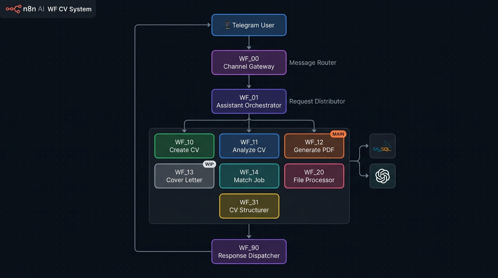

# 🔵 WF_CV_System — منصة تطوير السيرة الذاتية (Microservices Architecture)

> نظام متكامل لتطوير السيرة الذاتية مبني على معمارية **Microservices** باستخدام **n8n**.  
> يعمل عبر **Telegram Bot** ويخزن البيانات في **MySQL**.

---

## معمارية النظام



---

## تدفق العمل (Workflow Flow)

```
📱 Telegram User
        │
        ▼
┌─────────────────────────────┐
│  WF_00_Channel_Gateway      │  ← يستقبل كل رسائل Telegram ويصنفها
└─────────────────────────────┘
        │
        ▼
┌─────────────────────────────┐
│  WF_01_Assistant_Orchestrator│  ← يوزع الطلبات على Sub-Workflows
└─────────────────────────────┘
        │
   ┌────┴────┬──────────┬──────────┬──────────┐
   ▼         ▼          ▼          ▼          ▼
WF_10     WF_11      WF_12      WF_14      WF_20
Create    Analyze   Gen PDF    Match Job  File Proc
        │
        ▼
┌─────────────────────────────┐
│  WF_31_CV_Structurer        │  ← يهيكل بيانات CV قبل التخزين
└─────────────────────────────┘
        │
        ▼
┌─────────────────────────────┐
│  WF_90_Response_Dispatcher  │  ← يرسل الرد النهائي للمستخدم
└─────────────────────────────┘
        │
        ▼
📱 Telegram User
```

---

## الملفات

| الملف | الوظيفة | Nodes | الحجم |
|-------|---------|-------|-------|
| `WF_00_Channel_Gateway.json` | **البوابة الرئيسية** — يستقبل رسائل Telegram ويوجهها | 29 | 31 KB |
| `WF_01_Assistant_Orchestrator.json` | **المنسق** — يوزع الطلبات على Sub-Workflows | 7 | 12 KB |
| `WF_10_Create_CV.json` | **إنشاء CV** — ينشئ سيرة ذاتية كاملة بالذكاء الاصطناعي | 18 | 42 KB |
| `WF_11_Analyze_CV.json` | **تحليل CV** — يحلل السيرة الذاتية ويقيّمها | 17 | 89 KB |
| `WF_12_Generate_Optimized_CV_PDF.json` | **توليد PDF** — يولّد PDF محسّن ومنسّق للسيرة الذاتية ⭐ | 27 | 175 KB |
| `WF_13_Generate_Cover_Letter_PDF.json` | **Cover Letter** — يولّد خطاب تقديم PDF | 2 | 2 KB |
| `WF_14_Match_CV_With_Job.json` | **مطابقة وظيفة** — يطابق CV مع متطلبات الوظيفة | 23 | 57 KB |
| `WF_20_File_Processor.json` | **معالجة ملفات** — يعالج PDF/DOCX المرفوعة ويستخرج النص | 29 | 30 KB |
| `WF_31_CV_Structurer.json` | **هيكلة البيانات** — ينظّم بيانات CV قبل تخزينها في MySQL | 7 | 13 KB |
| `WF_90_Response_Dispatcher.json` | **مُرسِل الردود** — يرسل الرد النهائي عبر Telegram | 5 | 6.5 KB |

> ⭐ **WF_12** هو أضخم ملف في النظام (175 KB) ويمثّل الناتج النهائي للمستخدم.  
> ⚠️ **WF_13** قيد التطوير حالياً (2 nodes فقط).

---

## التقنيات المستخدمة

| التقنية | الاستخدام |
|---------|----------|
| **OpenAI GPT-4** | توليد وتحليل محتوى السيرة الذاتية |
| **MySQL** | تخزين بيانات المستخدمين والـ CVs |
| **Telegram Bot API** | قناة التواصل الرئيسية مع المستخدم |
| **HTTP API** | استدعاء خدمة توليد PDF الخارجية |
| **n8n Sub-Workflows** | معمارية Microservices المرنة |

---

## نقاط القوة

- **Microservices Architecture** — كل وظيفة في workflow مستقل → سهولة التطوير والصيانة
- **Separation of Concerns** — البوابة (WF_00) منفصلة عن المنطق (WF_01+) ومنفصلة عن الرد (WF_90)
- **Scalable Design** — يمكن إضافة sub-workflows جديدة دون المساس بالنظام الحالي

---

## ملاحظة للمطورين

هذا المشروع هو **الإصدار الأحدث والأكثر نضجاً** في هذا الـ Repository.  
الجيل السابق منه موجود في [`02_CvDevloper/`](../02_CvDevloper/README.md) بمعمارية Monolithic.
