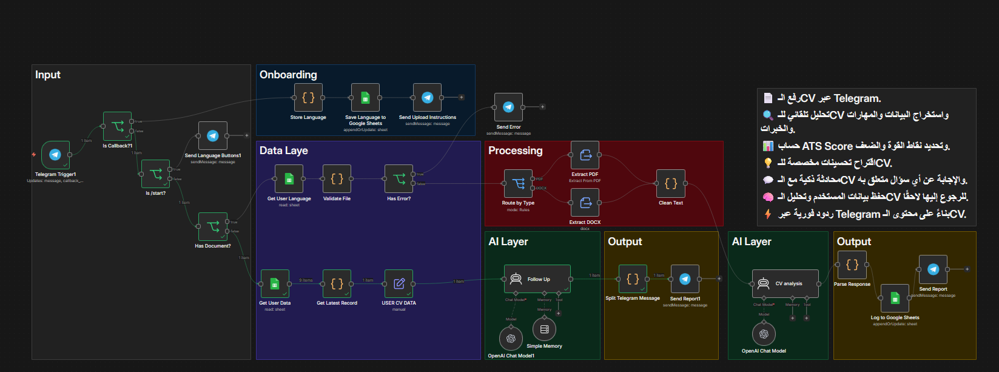

# 🟢 AI CV Assistant — Conversational Resume Builder

> An AI-powered resume assistant that helps users **create, improve, and optimize** their CVs through a natural conversation interface.  
> Built with a single **n8n AI Agent** node powered by **OpenAI GPT-4**.


---

## 📷 System Preview



---

## 📂 Workflow File

| File | Description | Size |
|------|-------------|------|
| `AI_CV_Assistant.json` | All-in-one AI Agent for CV creation and optimization | 26 KB |

---

## 🔄 How It Works

```
User (n8n Chat UI)
        │
        ▼
┌───────────────────────────┐
│       AI CV Assistant        │
│    (n8n AI Agent Node)       │
│                              │
│   • Understands the request  │
│   • Asks clarifying questions│
│   • Generates CV content     │
│   • Suggests improvements    │
└───────────────────────────┘
        │
        ▼
  ┌──────────┤
  │ OpenAI  │  ← Generates smart, structured content
  │  GPT-4  │
  └──────────┘
        │
        ▼
   Improved CV + Suggestions
```

---

## ✨ What the Assistant Can Do

| Capability | Description |
|-----------|-------------|
| **CV Creation** | Guides users step-by-step to build a complete resume from scratch |
| **CV Improvement** | Reviews an existing CV and suggests targeted improvements |
| **Content Optimization** | Rewrites sections to be more impactful and professional |
| **ATS Guidance** | Advises on keywords and formatting to improve ATS compatibility |
| **Q&A** | Answers any question about CVs, job applications, and best practices |

---

## 🛠️ Tech Stack

| Technology | Role |
|-----------|------|
| **OpenAI GPT-4** | Core intelligence — generates and refines all CV content |
| **n8n AI Agent** | Manages the conversation flow and tool execution |
| **n8n Chat UI** | Built-in web chat interface — no external app needed |

---

## 💬 Example Conversation

```
User:   "I'm a backend developer with 3 years of experience in Python and Django.
         Help me create a professional CV."

Agent:  "Great! Let's build your CV. A few quick questions:
         1. What are your top 3 technical achievements?
         2. Any specific roles or companies you're targeting?
         3. Do you have open-source contributions or certifications?"

User:   "I built a REST API that handles 10k requests/sec, contributed to Django,
         and I hold an AWS Solutions Architect certification."

Agent:  [Generates a structured, professional CV with impact-driven bullet points]
```

---

## 📦 Project Context

This project is the **first-generation prototype** of the CV system in this repository.  
It uses a simple, single-agent approach (Monolithic architecture).

For the full-featured platform with Microservices, PDF generation, MySQL storage, and Telegram integration, see [`01_WF_CV_System/`](../01_WF_CV_System/README.md).

| Feature | AI CV Assistant (this) | WF CV System |
|---------|----------------------|---------------|
| Architecture | Single Agent | Microservices (10 workflows) |
| Interface | n8n Chat UI | Telegram Bot |
| PDF Output | ❌ | ✅ |
| Data Storage | ❌ | MySQL |
| Job Matching | ❌ | ✅ |
| Best for | Quick prototyping | Production use |
