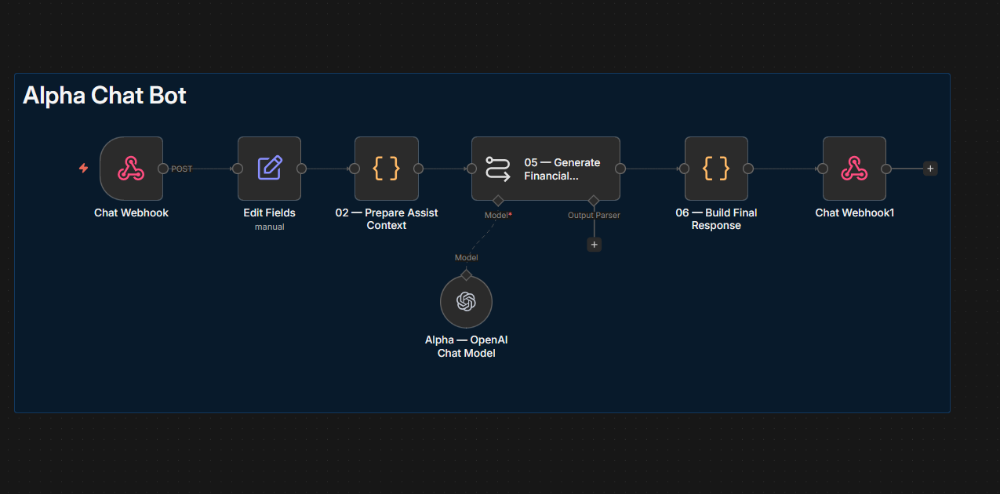
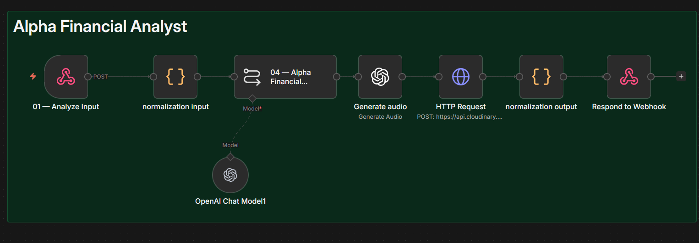
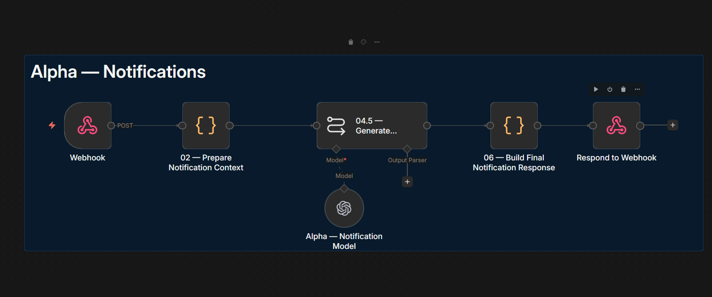
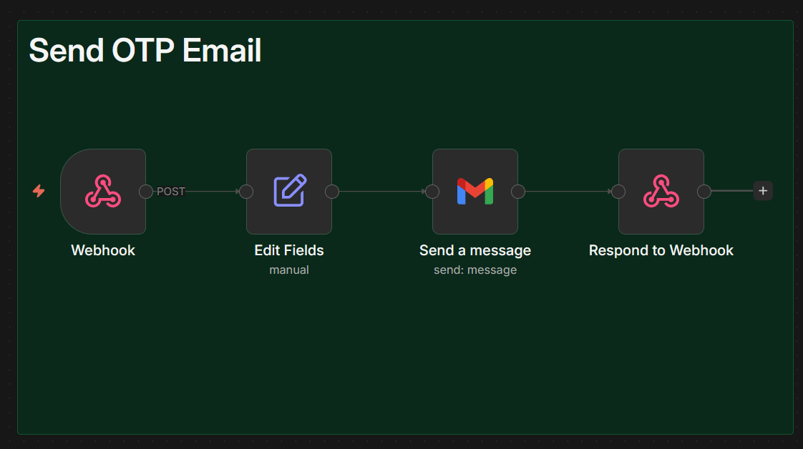

# 🟠 Alpha Finance — نظام الذكاء المالي

> نظام AI متخصص في **استخراج وتحليل المعاملات المالية** من صور ونصوص.  
> يعمل عبر **Webhook REST API** — كل workflow يستجيب لـ endpoint مستقل.

---

## لقطات من النظام

| Chat Bot | Financial Analyst |
|----------|-----------------|
|  |  |

| Notifications | Send OTP Email |
|--------------|----------------|
|  |  |

---

## معمارية النظام

```
Client Application
        │
        ├── POST /receipt       ──▶  Alpha_Transaction_Extraction.json
        │                              └── [OCR + OpenAI Vision → JSON]
        │
        ├── POST /analyze       ──▶  Alpha_Analyze.json
        │                              └── [GPT-4 + Structured Output]
        │
        ├── POST /assist        ──▶  Alpha_Assist.json
        │                              └── [AI Agent + Memory]
        │
        ├── POST /notification  ──▶  Alpha_Notifications.json
        │                              └── [Push Notification]
        │
        └── POST /otp           ──▶  Alpha-OTP.json
                                       └── [Gmail OTP Sender]
```

---

## الملفات

| الملف | الـ Endpoint | الوظيفة | Nodes | الحجم |
|-------|-------------|---------|-------|-------|
| `Alpha_Transaction_Extraction.json` | `POST /receipt` | استخراج معاملات من صور الفواتير وكشوف الحساب | 19 | 33 KB |
| `Alpha_Analyze.json` | `POST /analyze` | تحليل البيانات المالية وتوليد تقرير | 9 | 29 KB |
| `Alpha_Assist.json` | `POST /assist` | مساعد مالي يرد على أسئلة المستخدم | 8 | 33 KB |
| `Alpha_Notifications.json` | `POST /notification` | إرسال إشعارات للمستخدمين | 7 | 4.6 KB |
| `Alpha-OTP.json` | `POST /otp` | نظام التحقق بكلمة مرور لمرة واحدة (OTP) عبر Gmail | 5 | 3.3 KB |

---

## التقنيات المستخدمة

| التقنية | الاستخدام |
|---------|----------|
| **OpenAI GPT-4 Vision** | تحليل صور الفواتير واستخراج البيانات |
| **OpenAI GPT-4** | تحليل النصوص المالية والإجابة على الأسئلة |
| **Structured Output Parser** | إخراج JSON منظم وقابل للمعالجة |
| **Webhook REST API** | نقطة الدخول لكل workflow بشكل مستقل |
| **Gmail API** | إرسال رمز OTP للتحقق من هوية المستخدم |

---

## لماذا هذا التصميم؟

| الميزة | التفصيل |
|--------|---------|
| **الاستقلالية** | كل workflow يعمل ويُطوَّر بشكل مستقل |
| **السرعة** | كل endpoint يعالج نوعاً واحداً فقط من الطلبات |
| **سهولة الاختبار** | استدعاء مباشر لكل workflow دون تشغيل نظام كامل |
| **وضوح المسؤولية** | Single Responsibility Principle لكل ملف |
