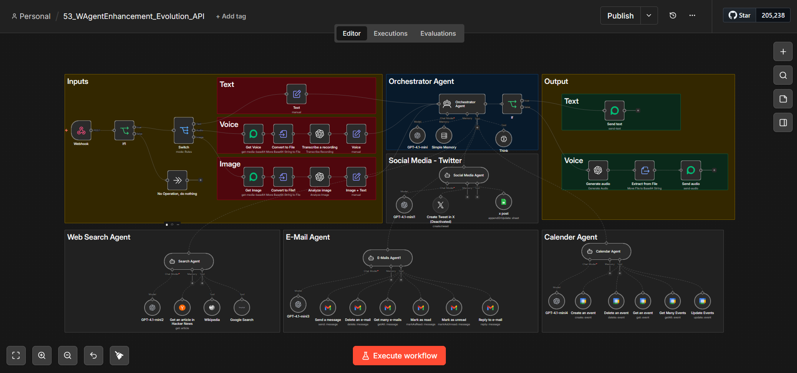
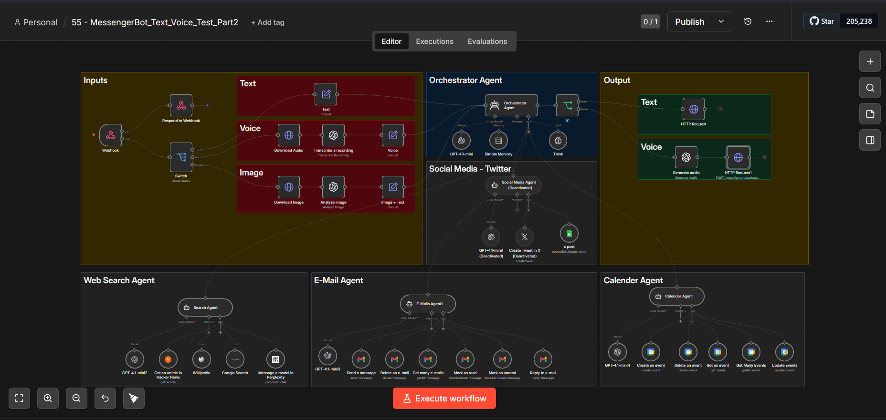

# 🔴 WAgent Chatbot — وكيل المحادثة الذكي المتعدد المنصات

> وكيل AI متكامل يعمل على **WhatsApp** و**Messenger** بقدرات بحث واسعة.  
> يدعم النصوص والرسائل الصوتية وإدارة التقويم والبريد الإلكتروني.

---

## لقطات من النظام

| WAgent + Evolution API | MessengerBot |
|------------------------|--------------|
|  |  |

---

## تسلسل التطور

```
WAgent_WhatsApp_Evolution_API.json
   ├── منصة: WhatsApp + Evolution API
   ├── Trigger: Webhook (بديل مرن عن WhatsApp Trigger المباشر)
   ├── أدوات: Calendar + Gmail + Search + Twitter + Sheets + Wikipedia + HackerNews
   ├── ذاكرة: Buffer Window Memory
   └── مرفقات: convertToFile + extractFromFile

              ↓ تطوير

WAgent_Messenger_Voice_Multiplatform.json
   ├── منصات: WhatsApp + Messenger (متعدد المنصات)
   ├── رسائل صوتية: OpenAI Whisper (Voice → Text)
   ├── بحث متقدم: Perplexity AI
   └── Think Tool: تفكير صامت قبل الرد
```

---

## الملفات

| الملف | المنصة | Nodes | الحجم | الوصف |
|-------|--------|-------|-------|-------|
| `WAgent_WhatsApp_Evolution_API.json` | WhatsApp + Evolution API | 58 | 36 KB | وكيل WhatsApp مع Evolution API لمرونة أعلى |
| `WAgent_Messenger_Voice_Multiplatform.json` | WhatsApp + Messenger | 55 | 33 KB | النسخة الأحدث — دعم كامل للصوت والمنصات المتعددة |

---

## التقنيات المستخدمة

| التقنية | الاستخدام |
|---------|----------|
| **OpenAI GPT-4** | دماغ الوكيل — فهم الطلبات وصياغة الردود |
| **Buffer Window Memory** | تذكر سياق المحادثة عبر الرسائل المتعاقبة |
| **SerpAPI** | بحث Google في الوقت الفعلي |
| **Wikipedia API** | البحث الموسوعي والمعلوماتي |
| **HackerNews API** | آخر أخبار التقنية والمطورين |
| **Google Calendar** | إدارة المواعيد (إنشاء/قراءة/تعديل/حذف) |
| **Gmail** | قراءة وإرسال وإدارة البريد الإلكتروني |
| **Twitter/X API** | نشر التغريدات برمجياً |
| **Google Sheets** | قراءة وكتابة البيانات في الجداول |
| **OpenAI Whisper** | تحويل الرسائل الصوتية إلى نص |
| **Perplexity AI** | بحث AI متقدم مع مصادر موثّقة |
| **Evolution API** | WhatsApp API مرن وقابل للتخصيص |

---

## المميزات الأساسية

| الميزة | التفاصيل |
|--------|---------|
| **Multi-Platform** | يعمل على WhatsApp وMessenger من instance واحد |
| **Voice Support** | يستقبل الرسائل الصوتية ويحوّلها لنص تلقائياً |
| **Memory** | يتذكر سياق المحادثة عبر Buffer Window Memory |
| **Think Tool** | يفكّر بصمت قبل الرد لتحسين جودة الإجابة |
| **Rich Toolset** | 12+ أداة متكاملة (بحث + تقويم + بريد + شبكات اجتماعية) |
