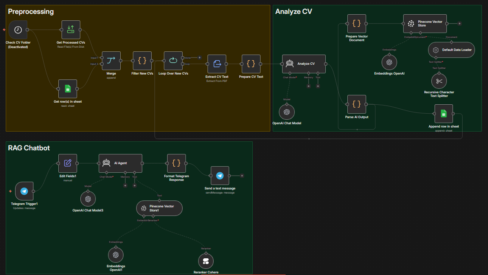

# 🟡 AI Recruitment & Candidate Matching Agent — Semantic RAG Pipeline

> An enterprise-grade recruitment matching pipeline leveraging **Vector Search** and **Retrieval-Augmented Generation (RAG)** to connect candidates with ideal job requisitions based on true semantic capability rather than superficial keyword matching.

<div align="center">


</div>

---

## 📷 System Overview



---

## 🏗️ How It Works (Two-Stage Retrieval Pipeline)

```
📄 Data Input (Job Descriptions or Candidate CVs)
        │
        ▼
┌─────────────────────────────────────────┐
│       Text Normalization & Chunking     │
└─────────────────────────────────────────┘
        │
        ▼
┌─────────────────────────────────────────┐
│       OpenAI Text Embeddings            │  ──▶ Converts text into high-dimensional vectors
└─────────────────────────────────────────┘
        │
        ▼
┌─────────────────────────────────────────┐
│       Pinecone Vector Database          │  ──▶ Stage 1: Ultra-fast semantic nearest-neighbor search (Top-K)
└─────────────────────────────────────────┘
        │
        ▼
┌─────────────────────────────────────────┐
│       Cohere Reranker                   │  ──▶ Stage 2: Cross-encoder re-ranking for contextual precision
└─────────────────────────────────────────┘
        │
        ▼
┌─────────────────────────────────────────┐
│       OpenAI GPT-4 Agent                │  ──▶ Synthesizes qualitative insights & hiring fit breakdown
└─────────────────────────────────────────┘
        │
        ▼
📊 Structured Candidate Match Report & Recommendations
```

---

## 📂 Workflow Specifications

| Workflow File | Core Purpose | Nodes | File Size | Trigger |
|---------------|--------------|-------|-----------|---------|
| `AI_Recruitment_Candidate_Matching.json` | Intelligent candidate-to-job matching via Pinecone vector indexing and Cohere re-ranking | 29 | 43 KB | Webhook / Manual Trigger |

---

## 🛠️ Technology Stack

| Technology | Role & Functionality |
|------------|----------------------|
| **Pinecone Vector DB** | High-performance vector database hosting candidate profiles and job requirements for sub-millisecond semantic retrieval |
| **OpenAI Embeddings** | Generates rich dense vector embeddings representing the underlying skills, responsibilities, and qualifications |
| **Cohere Rerank** | Advanced cross-encoder model that evaluates query-document pairs together to significantly boost search precision |
| **OpenAI GPT-4** | Analyzes the top reranked matches, explains why candidates fit the role, and highlights potential skill gaps |
| **n8n Orchestration** | Manages data flow, transformation pipelines, API credentials, and response formatting |

---

## 🎯 Key Advantages

| Feature | Description |
|---------|-------------|
| **Semantic Understanding** | Goes beyond exact keyword matches (e.g., understands that "Kubernetes experience" relates to "Container Orchestration") |
| **Two-Stage Retrieval** | Combines the raw speed of vector similarity search with the hyper-accurate relevance scoring of Cohere Rerank |
| **Explainable AI Matching** | Rather than a blind compatibility percentage, provides clear justifications for why a candidate was shortlisted |
| **Enterprise Scalability** | Efficiently scales across thousands of resumes and requisitions without performance degradation |

---

## 📋 Typical Recruiter Workflow

```
Recruiter submits Job Description: "Lead Backend Engineer with Distributed Systems experience"
       │
       ▼
System computes vector embedding and queries Pinecone
       │
       ▼
Retrieves top 20 candidate CV vectors based on cosine similarity
       │
       ▼
Cohere Rerank refines candidates down to the top 5 most relevant profiles
       │
       ▼
GPT-4 compiles detailed scorecard: Strengths, Weaknesses, and Skill Match Breakdown
```
