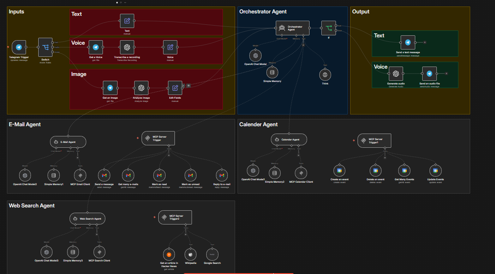

# 🟠 Secretary MCP — السكرتير الذكي بـ MCP Protocol

> وكيل AI يعمل على **Telegram** ويستخدم **MCP (Model Context Protocol)**  
> لإدارة التقويم والبريد الإلكتروني والمهام اليومية بشكل ذكي.

---

## لقطة من النظام



---

## كيف يعمل

```
📱 Telegram (رسالة المستخدم)
        │
        ▼
┌────────────────────────────────┐
│   Secretary_MCP_Telegram.json  │
│   ┌──────────────────────────┐ │
│   │   AI Agent (GPT-4)       │ │  ← يفهم الطلب ويقرر الأداة
│   │   + Memory Buffer Window │ │  ← يتذكر سياق المحادثة
│   └──────────────────────────┘ │
│              │                 │
│        MCP Client              │  ← يتصل بأدوات خارجية
│   ┌──────────────────────────┐ │
│   │  Google Calendar (4 tools)│ │
│   │  Gmail          (5 tools)│ │
│   │  SerpAPI        (بحث)   │ │
│   │  Wikipedia      (معلومات)│ │
│   │  HackerNews     (أخبار) │ │
│   └──────────────────────────┘ │
└────────────────────────────────┘
        │
        ▼
📱 Telegram (رد ذكي ومفصّل)
```

---

## الملف

| الملف | الوظيفة | Nodes | الحجم |
|-------|---------|-------|-------|
| `Secretary_MCP_Telegram.json` | سكرتير ذكي متكامل عبر Telegram بـ MCP Protocol | 55 | 25 KB |

---

## التقنيات المستخدمة

| التقنية | الاستخدام |
|---------|----------|
| **MCP Protocol** | Model Context Protocol — يفصل الأدوات عن الوكيل |
| **OpenAI GPT-4** | دماغ الوكيل — فهم الطلبات وتحديد الأداة المناسبة |
| **Buffer Window Memory** | تذكر سياق المحادثة عبر الجلسات |
| **Google Calendar API** | إنشاء / قراءة / تعديل / حذف المواعيد |
| **Gmail API** | قراءة وإرسال وإدارة البريد الإلكتروني |
| **SerpAPI** | البحث على Google في الوقت الفعلي |
| **Wikipedia API** | البحث الموسوعي عن أي معلومة |
| **Telegram Bot API** | قناة التواصل الرئيسية مع المستخدم |

---

## ما يميّز MCP Protocol؟

```
التصميم التقليدي:
  AI Agent ←→ أدوات مدمجة (مقيّدة + صعبة التوسعة)

تصميم MCP:
  AI Agent ←→ MCP Client ←→ MCP Server ←→ أدوات خارجية
                                        (قابلة للإضافة والتوسعة)
```

**MCP يسمح بـ:**
- تشغيل الأدوات على خادم منفصل عن الوكيل
- إضافة أدوات جديدة دون تعديل الوكيل
- مرونة أعلى وقابلية للتوسع

---

## أمثلة على الأوامر

```
المستخدم: "ذكّرني باجتماع غداً الساعة 3"
    → Calendar: إنشاء حدث جديد

المستخدم: "اقرأ آخر إيميل من فريق العمل"
    → Gmail: جلب وعرض آخر بريد

المستخدم: "ابحث عن أفضل مطاعم في عمّان"
    → SerpAPI: بحث Google + تلخيص النتائج
```
