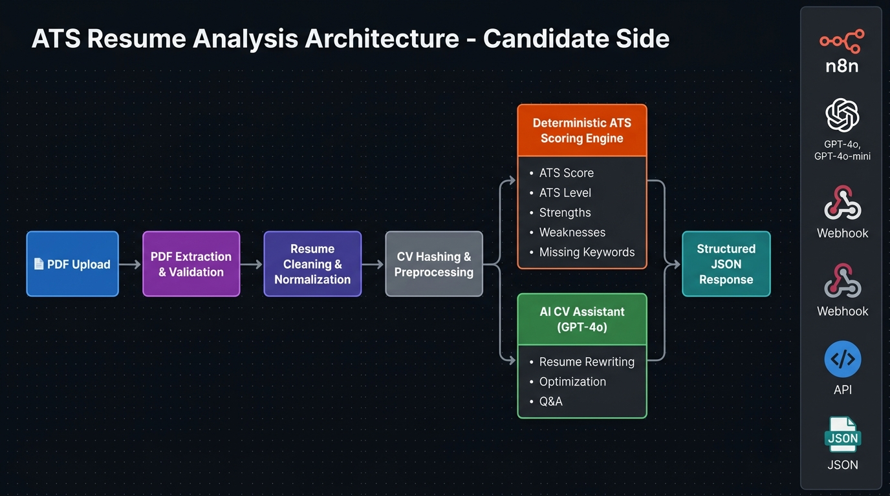
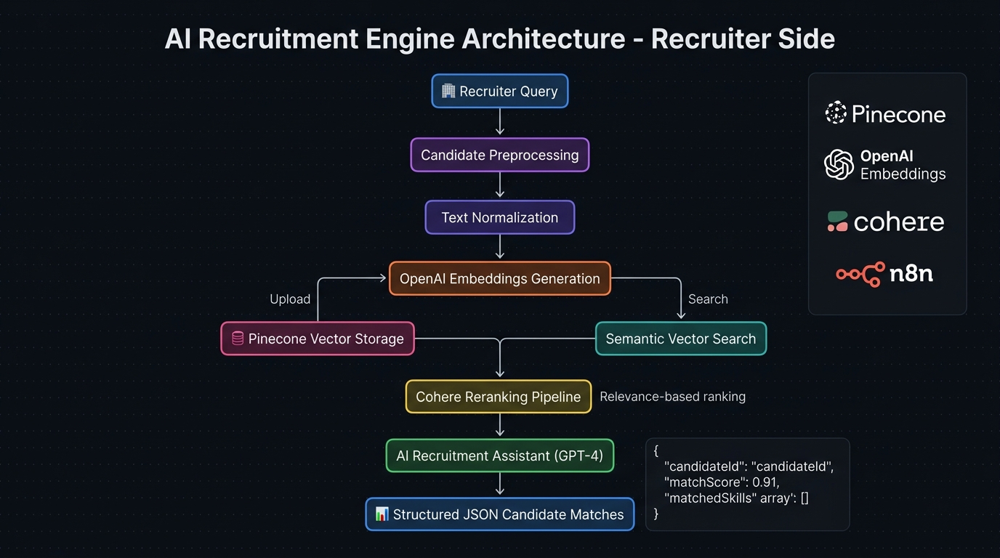

# 🤖 AI Recruitment Ecosystem — منظومة التوظيف الذكي

> منظومة AI متكاملة لأتمتة عملية التوظيف من جانبَي المرشح والشركة.  
> مبنية على **n8n** مع OpenAI، Pinecone، وCohere.

---

## نظرة عامة على المنظومة

هذه المنظومة تتكون من **جانبين متكاملين**:

| الجانب | الملف | الوصف |
|--------|-------|-------|
| 👤 **Candidate Side** | `ATS_Resume_Analyzer.json` | تحليل السيرة الذاتية، تقييم ATS، مساعد CV ذكي |
| 🏢 **Recruiter Side** | `AI_Recruitment_Engine.json` | محرك التوظيف الدلالي — Pinecone + Cohere |

---

## 👤 الجانب الأول — ATS Resume Analyzer (Candidate Side)

### المعمارية



### كيف يعمل

```
📄 PDF Upload
        │
        ▼
┌─────────────────────────────┐
│  PDF Extraction & Validation │
└─────────────────────────────┘
        │
        ▼
┌─────────────────────────────┐
│  Resume Cleaning &          │
│  Normalization              │
└─────────────────────────────┘
        │
        ▼
┌─────────────────────────────┐
│  CV Hashing & Preprocessing │
└─────────────────────────────┘
        │
   ┌────┴────────────────────┐
   ▼                         ▼
┌──────────────────┐  ┌──────────────────────┐
│  Deterministic   │  │  AI CV Assistant     │
│  ATS Scoring     │  │  (GPT-4o)            │
│  Engine          │  │                      │
│  ─────────────── │  │  • Resume Rewriting  │
│  • ATS Score     │  │  • Optimization      │
│  • ATS Level     │  │  • Resume Q&A        │
│  • Strengths     │  │  • Section Rewriting │
│  • Weaknesses    │  │  • ATS Explanation   │
│  • Keywords      │  └──────────────────────┘
└──────────────────┘
        │                    │
        └──────┬─────────────┘
               ▼
   ┌─────────────────────┐
   │  Structured JSON    │
   │  Response           │
   └─────────────────────┘
```

### مميزات ATS Resume Analyzer

#### 🎯 ATS Analysis
- **Deterministic ATS Scoring** — نقاط موضوعية وقابلة للتكرار
- **ATS Compatibility Evaluation** — تقييم التوافق مع أنظمة التوظيف
- **Strengths & Weaknesses Analysis** — تحليل نقاط القوة والضعف
- **Missing Keyword Detection** — اكتشاف الكلمات المفقودة
- **Structured JSON Outputs** — ردود JSON منظمة ودقيقة
- **Resume Quality Assessment** — تقييم شامل لجودة السيرة الذاتية

#### 🤖 AI CV Assistant
- **Resume Rewriting** — إعادة كتابة السيرة الذاتية كاملة
- **Improvement Suggestions** — اقتراحات تحسين مخصصة
- **ATS Explanation Assistant** — شرح مبدأ عمل ATS
- **Resume-focused Q&A** — أسئلة وأجوبة متخصصة
- **Section Rewriting** — إعادة كتابة أقسام محددة
- **Professional Optimization** — تحسين احترافي موجّه

#### ⚙️ Resume Processing Pipeline
- **PDF Upload Validation** — التحقق من صحة الملف المرفوع
- **PDF Text Extraction** — استخراج النص من PDF
- **Resume Cleaning & Normalization** — تنظيف وتوحيد النص
- **CV Hashing & Preprocessing** — معالجة مسبقة للسيرة الذاتية

### مثال على مخرجات ATS

```json
{
  "success": true,
  "userId": 139,
  "cvId": 35,
  "atsScore": 78,
  "atsLevel": "Good",
  "summary": "Backend Software Developer with 2 years of experience in building scalable server-side systems.",
  "strengths": [
    "Strong technical skills in multiple programming languages",
    "Experience with AI integration and scalable system development"
  ],
  "weaknesses": [
    "Lack of measurable achievements in professional experience",
    "Projects lack specific outcomes or metrics"
  ],
  "recommendations": [
    "Add measurable achievements such as performance improvements or efficiency gains.",
    "Include specific outcomes for projects to demonstrate business value."
  ],
  "missingKeywords": ["Docker", "CI/CD", "Unit Testing"],
  "isAnalyzed": true
}
```

---

## 🏢 الجانب الثاني — AI Recruitment Engine (Recruiter Side)

### المعمارية



### كيف يعمل

```
🏢 Recruiter Search Query
        │
        ▼
┌────────────────────────────┐
│  Candidate Preprocessing   │
│  + Text Normalization      │
└────────────────────────────┘
        │
        ▼
┌────────────────────────────┐
│  OpenAI Embeddings         │  ← تحويل النص لمتجهات رقمية
│  Generation                │
└────────────────────────────┘
        │
   ┌────┴──────────────┐
   ▼ (Upload)          ▼ (Search)
┌──────────────┐  ┌────────────────────┐
│   Pinecone   │  │  Semantic Vector   │
│   Vector     │  │  Search            │
│   Storage    │  └────────────────────┘
└──────────────┘          │
                          ▼
              ┌───────────────────────┐
              │  Cohere Reranking     │  ← إعادة ترتيب بالصلة
              │  Pipeline             │
              └───────────────────────┘
                          │
                          ▼
              ┌───────────────────────┐
              │  AI Recruitment       │
              │  Assistant (GPT-4)    │
              └───────────────────────┘
                          │
                          ▼
              📊 Structured JSON Candidate Matches
```

### مميزات AI Recruitment Engine

#### 🔍 Semantic Candidate Search
- **Natural Language Search** — البحث بلغة طبيعية بدلاً من keywords
- **Context-aware Retrieval** — استرجاع يفهم السياق
- **Skill & Experience Matching** — مطابقة المهارات والخبرات
- **Meaning-based Search** — البحث حسب المعنى لا المطابقة الحرفية

#### 📦 Vector Indexing Pipeline
- **Candidate Profile Preprocessing** — معالجة بيانات المرشح
- **Skills Normalization** — توحيد وصف المهارات
- **OpenAI Embeddings Generation** — توليد متجهات دلالية
- **Pinecone Vector Storage** — تخزين وفهرسة سريعة

#### 🎯 AI Reranking
- **Cohere Reranking Pipeline** — خط إعادة الترتيب الدلالي
- **Relevance-based Ranking** — ترتيب حسب الصلة الحقيقية
- **Improved Search Quality** — دقة بحث أعلى بمرحلتين
- **Intent Understanding** — فهم نية المجنّد لا كلماته فقط

#### 🤖 Recruitment Assistant
- **AI-assisted Recommendations** — توصيات مدعومة بالذكاء الاصطناعي
- **Structured Candidate Matching** — مطابقة منظمة وقابلة للتتبع
- **Query Understanding** — فهم الاستعلام بعمق
- **Recruitment-focused Formatting** — ردود مهيكلة لفريق HR

### مثال على الاستعلام والمخرجات

**استعلام المجنّد:**
```
Need a React developer with experience in AI automation, dashboards, and API integration
```

**النظام يفهم المعنى ويعيد:**
```json
{
  "success": true,
  "query": "Need a React developer with experience in AI automation and dashboards",
  "matches": [
    {
      "candidateId": 21,
      "name": "Candidate Name",
      "matchScore": 0.91,
      "matchedSkills": ["React.js", "API Integration", "AI Automation"],
      "reason": "Candidate has strong React experience, dashboard projects, and AI workflow integration exposure."
    }
  ]
}
```

---

## الملفات

| الملف | الجانب | الوظيفة | الحجم |
|-------|--------|---------|-------|
| `ATS_Resume_Analyzer.json` | Candidate Side | تحليل ATS + مساعد CV ذكي | 82 KB |
| `AI_Recruitment_Engine.json` | Recruiter Side | محرك التوظيف الدلالي | 23 KB |

---

## التقنيات المستخدمة

### Automation
| التقنية | الاستخدام |
|---------|----------|
| **n8n** | منصة الأتمتة والـ workflows |

### AI & Search
| التقنية | الاستخدام |
|---------|----------|
| **OpenAI GPT-4o** | تحليل السيرة الذاتية + مساعد CV |
| **OpenAI GPT-4o-mini** | معالجة سريعة للطلبات |
| **OpenAI Embeddings** | تحويل النصوص لمتجهات دلالية |
| **Pinecone Vector DB** | تخزين وبحث فائق السرعة |
| **Cohere Reranking** | إعادة ترتيب النتائج بدقة أعلى |

### Processing & Infrastructure
| التقنية | الاستخدام |
|---------|----------|
| **PDF Extraction** | استخراج النص من ملفات PDF |
| **JavaScript Preprocessing** | معالجة وتنظيف البيانات |
| **Deterministic ATS Scoring** | تقييم موضوعي وقابل للتكرار |
| **Webhooks + JSON APIs** | نقاط الدخول لكل workflow |

---

## تدفق البيانات الكامل

```
[المرشح يرفع CV]              [المجنّد يبحث عن مرشح]
        │                              │
        ▼                              ▼
  ATS_Resume_Analyzer          AI_Recruitment_Engine
        │                              │
        ▼                              ▼
  [ATS Score + AI Tips]    [أفضل المرشحين مرتّبين]
        │                              │
        └──────────────┬───────────────┘
                       ▼
            [نظام توظيف متكامل]
```

---

## مساهمتي في هذا النظام

| المجال | المساهمة |
|--------|---------|
| **n8n Workflow Logic** | تصميم workflows جانب المرشح والمجنّد |
| **ATS Scoring Engine** | بناء محرك التقييم الحتمي |
| **Candidate Preprocessing** | معالجة بيانات المرشحين |
| **OpenAI Embeddings** | بناء pipeline الـ embeddings |
| **Pinecone Integration** | دمج قاعدة البيانات الشعاعية |
| **Cohere Reranking** | بناء خط إعادة الترتيب |
| **JSON APIs** | هيكلة ردود JSON المنظمة |
