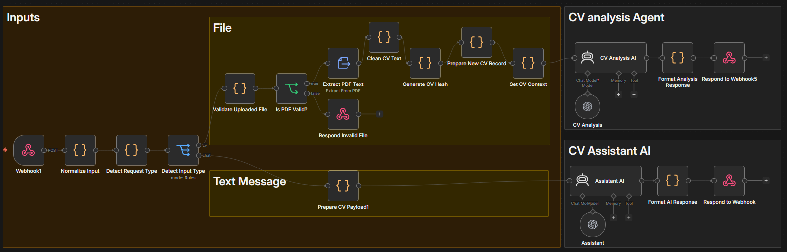
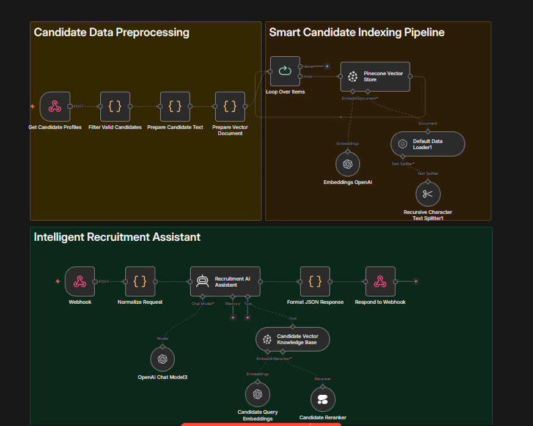

# 🗂️ teckNetworks — ملفات تجريبية وأرشيف

> هذا المجلد يحتوي على **نسخ تجريبية قديمة** من المشاريع الرئيسية.  
> محتفَظ بها كمرجع تطوري — لا تُستخدم في الإنتاج.

---

## الملفات

| الملف | الحجم | الأصل | الوصف |
|-------|-------|-------|-------|
| `CV_Developer_Archive.json` | 82 KB | `02_CvDevloper` | نسخة تجريبية من وكيل CvDeveloper |
| `Candidate_Company_Matching_Archive.json` | 23 KB | `05_CV_Matching_RAG` | نسخة تجريبية من نظام مطابقة المرشحين |

---

## الصور المرجعية

| CV Developer | Candidate Company |
|------------|-------------------|
|  |  |

---

## ملاحظة

> ⚠️ **هذه الملفات للأرشفة فقط.**  
> للنسخ الحديثة والمطوّرة، راجع:
> - [`01_WF_CV_System/`](../01_WF_CV_System/README.md) — المنصة الكاملة
> - [`02_CvDevloper/`](../02_CvDevloper/README.md) — مساعد CV
> - [`05_CV_Matching_RAG/`](../05_CV_Matching_RAG/README.md) — نظام المطابقة الذكي
